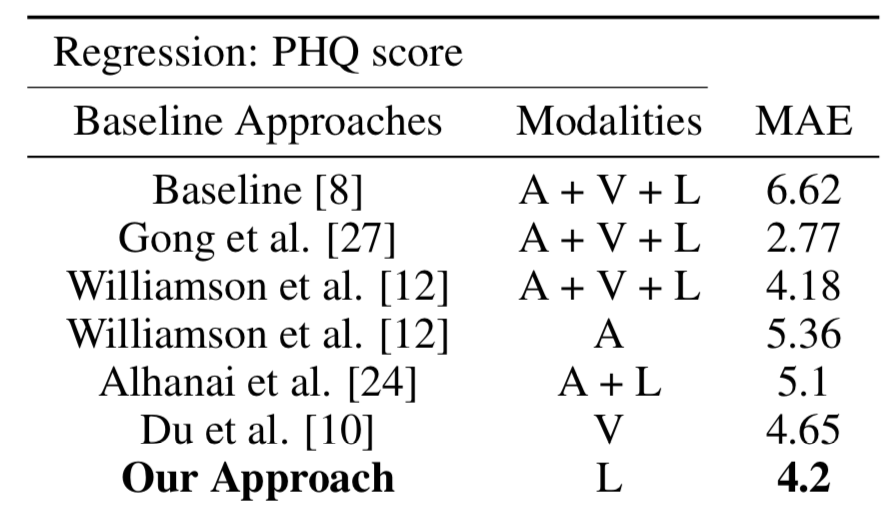

# Predicting Depression Severity from Text Using a Relational-Graph Neural Network to Represent the Underlying Cognitive Bias
This repo contains scripts to model depression in text.

### Data
The data used can be downloaded from the [Distress Analysis Interview Corpus](http://dcapswoz.ict.usc.edu/), and contains audio, video, and text of interviews with 142 subjects, about 30% of whom had some level of depression.

### Note
The data including real human participants cannot be released in public. Data accessing permission is required before using of those data. More details can be found [here](http://dcapswoz.ict.usc.edu/).

### Files
The repo contains the following files:

- **train.py** which contains the methods used to train the model.
- **model.py** which contains the gnn model
- **eval.py**  which evaluate the model
- **vis_gnn.py** which contains visualization for evaluating the doc
- **requirements.txt** which are the libraries used in the conda environment of this project.
- **data_helper** which contains the method of converting the text to graph
- **pmi.py** which contains the method of computing the edge weights between word nodes

## Results

Our model achieves the following performance on :

### PHQ regression



<!--### Loss Curve-->
<!---->
<!---->

pyTorch back-end was used for modeling.

## Libraries
I used the following librarires:
```
Python version: 3.6
torch==1.5.0+cu101
cuda10.1
tensorflow-gpu=1.15.2=0
tensorflow-gpu-base=1.15.2=py36h01caf0a_0
```
